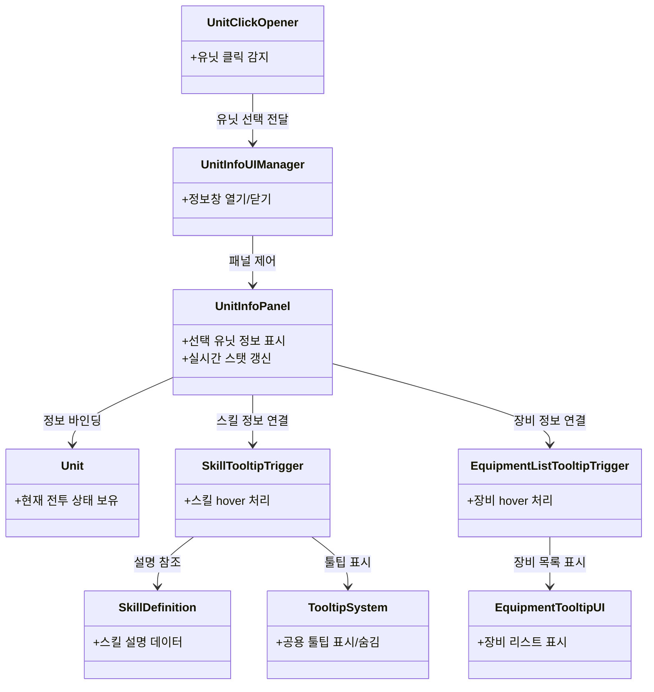

### [5. 캐릭터 정보 UI와 Hover Tooltip](https://github.com/YoungHyun1728/CommanderRogue/blob/main/ProjectDescription/5.%20Hover%20Tooltip-Based%20UI%20Interaction%20System.md)
이 문서에서는 전투 중 캐릭터를 클릭했을 때 정보를 보여주는 `캐릭터 정보 UI`와, 그 내부에서 동작하는 `스킬 툴팁`, `장비 툴팁` 상호작용을 설명합니다.

이 기능은 단순한 hover 안내 UI가 아니라, `월드의 유닛 선택 -> 정보 패널 표시 -> 세부 정보 hover 확장`으로 이어지는 다단계 정보 열람 구조입니다.  
즉, 플레이어는 먼저 유닛을 클릭해 큰 정보를 열고, 그 안에서 필요한 요소만 다시 hover하여 세부 설명을 확인할 수 있습니다.

< 캐릭터 정보 UI 및 스킬/장비 툴팁 - 클래스 다이어그램 >

### 1. 시스템 개요

현재 캐릭터 정보 UI는 다음 흐름으로 동작합니다.

1. 플레이어가 전투 화면의 유닛을 클릭한다.
2. 클릭된 유닛을 기준으로 `UnitInfoUIManager`가 정보 패널을 연다.
3. `UnitInfoPanel`이 선택된 유닛의 현재 상태를 UI에 바인딩한다.
4. 패널 내부에서 스킬 아이콘이나 장비 영역에 마우스를 올리면 세부 툴팁이 추가로 열린다.

즉, 캐릭터 정보창이 1차 정보 제공 계층이고, 스킬/장비 툴팁은 그 안에서 작동하는 2차 정보 제공 계층입니다.

### 2. 캐릭터 클릭과 정보창 열기

캐릭터 선택의 시작점은 `UnitClickOpener`입니다.

- 마우스 좌클릭 입력을 감지한다.
- 클릭 위치를 월드 좌표로 변환한다.
- `Physics2D.OverlapPoint`로 해당 위치의 유닛 콜라이더를 찾는다.
- 유닛이 있으면 `UnitInfoUIManager.Instance.Open(unit)`을 호출한다.

이 방식은 전투 필드의 실제 유닛 오브젝트를 바로 선택 대상으로 삼기 때문에, 별도의 선택 리스트 UI 없이도 직관적으로 상세 정보를 확인할 수 있게 해줍니다.

그 다음 `UnitInfoUIManager`는 씬에 배치된 고정 위치 패널을 켜고, 선택된 유닛을 `UnitInfoPanel`에 전달합니다.  
즉, 월드 클릭 입력과 실제 패널 렌더링 책임을 분리해 둔 구조입니다.

### 3. 캐릭터 정보창 구성

실제 정보 표시를 담당하는 것은 `UnitInfoPanel`입니다.

이 패널은 선택된 유닛을 `Bind(Unit unit)`으로 받아 다음 정보를 표시합니다.

- 초상화, 이름, 레벨
- 현재 HP/MP와 최대 HP/MP
- 힘, 민첩, 지능
- 공격력, 공격 사거리, 공격 속도
- 체력 재생, 마나 재생, 치명타 확률, 치명타 피해량, 추가 경험치 등 상세 스탯

또한 유닛의 주 스탯에 따라 아이콘 표시를 바꾸고, 현재 유닛이 보유한 풀마나 스킬과 장착 장비를 패널 내부 상호작용에 연결합니다.

중요한 점은 이 패널이 `선택 당시 값만 보여주는 정적 화면`이 아니라는 것입니다.  
`Update()`에서 현재 바인딩된 유닛을 기준으로 계속 `Refresh()`를 수행하기 때문에, 전투 도중 HP/MP나 스탯 변화가 일어나도 패널 값이 실시간으로 갱신됩니다.

즉, 이 UI는 단순 프로필 창이 아니라 `현재 전투 상태를 관찰하는 실시간 인스펙션 패널`에 가깝습니다.

### 4. 스킬 호버링 UI

캐릭터 정보창 내부에서 스킬 설명은 `SkillTooltipTrigger`를 통해 제공됩니다.

동작 방식은 다음과 같습니다.

1. `UnitInfoPanel`이 현재 유닛과 스킬 객체를 `SkillTooltipTrigger`에 전달한다.
2. 플레이어가 패널 내부의 스킬 아이콘에 마우스를 올리면 `OnPointerEnter`가 호출된다.
3. `TooltipSystem`이 기존 툴팁을 정리한 뒤, `TooltipChannel.UnitSkill` 채널에 스킬 설명을 띄운다.
4. 마우스를 떼면 해당 채널의 툴팁이 닫힌다.

여기서 중요한 점은 스킬 설명이 고정 문자열이 아니라는 것입니다.  
`SkillDefinition.BuildRuntimeDescription()`은 `SkillTooltipTemplate.Render()`를 호출해, 설명 문자열 안의 수식을 현재 유닛 스탯 기준으로 계산합니다.

예를 들어 설명 안에 힘, 민첩, 지능, 공격력, 최대 체력 같은 변수가 포함되어 있으면:

- 현재 유닛의 실제 스탯을 읽고
- 수식을 계산한 뒤
- 최종 숫자를 치환해서 툴팁에 보여줍니다.

즉, 스킬 툴팁은 단순 텍스트가 아니라 `현재 유닛 상태를 반영하는 런타임 설명 UI`입니다.  
이 덕분에 같은 스킬이라도 장비나 성장 상태에 따라 실제 효과 수치를 더 정확하게 전달할 수 있습니다.

### 5. 장비 호버링 UI

장비 정보는 `EquipmentListTooltipTrigger`와 `EquipmentTooltipUI`를 통해 표시됩니다.

동작 방식은 다음과 같습니다.

1. `UnitInfoPanel`이 현재 유닛을 `EquipmentListTooltipTrigger`에 전달한다.
2. 플레이어가 장비 영역에 마우스를 올리면 `EquipmentTooltipUI.ShowList()`가 호출된다.
3. 현재 유닛의 장착 장비 목록을 읽어 툴팁 패널에 표시한다.
4. 마우스를 떼면 툴팁을 닫는다.

이 장비 툴팁은 단순히 장비 이름만 보여주지 않습니다.

- 동일 장비는 그룹으로 묶어서 수량을 표시하고
- 각 장비의 능력치를 한 줄 요약으로 보여주며
- 내용이 많을 경우 스크롤 위치와 레이아웃을 다시 정리합니다

즉, 장비 툴팁은 `현재 유닛이 실제로 무엇을 착용하고 있고 그 장비가 어떤 효과를 주는지`를 빠르게 읽기 위한 요약형 리스트 UI입니다.

### 6. 툴팁 시스템과의 연결

이 캐릭터 정보창은 독립된 패널이지만, 내부 hover 상호작용은 공용 `TooltipSystem` 위에서 동작합니다.

현재 `TooltipSystem`은 채널 기반으로 UI를 구분합니다.

- `Biome`
- `UnitSkill`
- `Stat`

이 구조 덕분에 스킬 툴팁, 스탯 툴팁, 바이옴 툴팁이 서로 충돌하지 않고 같은 시스템 안에서 관리됩니다.  
또한 `UnitInfoPanel`은 처음 열릴 때 `PrewarmTooltips()`를 호출해 빈 툴팁을 한 번 열고 닫음으로써, 첫 hover 시 레이아웃이 튀는 문제를 줄이도록 구성되어 있습니다.

즉, 캐릭터 정보창은 단독 UI가 아니라, 프로젝트 전반의 툴팁 시스템과 연결된 허브 역할을 합니다.

### 7. 왜 이 UI가 중요한가

이 시스템이 중요한 이유는 전투 정보가 많아질수록 `정보를 한 번에 다 보여주는 것`보다 `필요한 순간에 필요한 정보만 꺼내 보여주는 방식`이 더 효율적이기 때문입니다.

이 프로젝트에서는:

- 월드 클릭으로 캐릭터를 선택하고
- 정보 패널에서 전체 스탯을 확인하고
- 패널 안에서 스킬과 장비를 hover하여 세부 내용을 확장하는

3단계 구조를 통해 정보량과 가독성 사이의 균형을 맞추고 있습니다.

### 8. 정리

CommanderRogue의 캐릭터 정보 UI는 단순한 상세창이 아니라, `전투 중 선택된 유닛의 현재 상태를 실시간으로 열람하고`, 그 안에서 `스킬`과 `장비`의 세부 정보를 추가로 탐색할 수 있도록 설계된 상호작용 시스템입니다.

정리하면 구조는 다음과 같습니다.

- `UnitClickOpener`가 월드 클릭으로 유닛을 선택한다.
- `UnitInfoUIManager`가 정보 패널의 열기/닫기를 담당한다.
- `UnitInfoPanel`이 현재 유닛의 상태를 실시간으로 표시한다.
- `SkillTooltipTrigger`가 스킬 설명을 런타임 계산형 툴팁으로 보여준다.
- `EquipmentListTooltipTrigger`와 `EquipmentTooltipUI`가 장착 장비를 리스트 형태로 보여준다.

따라서 이 시스템은 단순 hover UI보다 더 넓은 의미의 `캐릭터 정보 열람 UI`로 보는 것이 맞고, 스킬 및 장비 hover는 그 내부에서 동작하는 세부 정보 확장 장치라고 정리할 수 있습니다.
